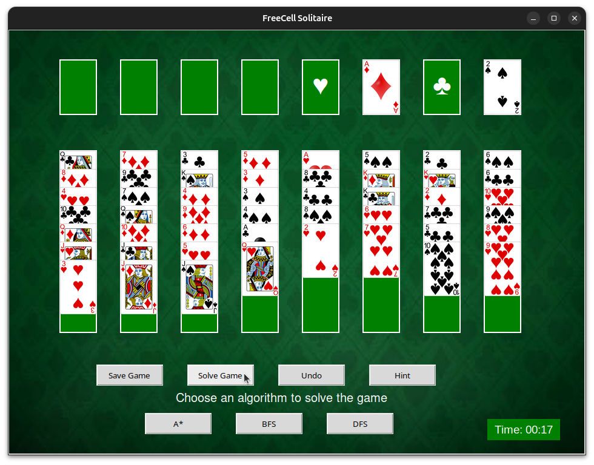

# 🃏 FreeCell Solitaire - AI Project

## Group T03G08

**Afonso Castro** @up202208026  
**Fernando Rodrigues** @up201105620  
**Sofia Bliznyuk** @up202209448

## Project Overview



This project implements the classic FreeCell Solitaire game using Python and Tkinter's graphical interface.
This game comes combined with AI search algorithms like Breadth-First Search (BFS), Depth-First Search (DFS), and A Star with heuristics, in order to solve the game automatically.


## Requirements

Make sure you have the following installed:
- Python 3.10 or higher
- Tkinter (usually comes with Python)
- Standard Python libraries used (time, random, json, PIL, etc.)


## How to Run

No compilation is necessary — it's written in Python.
To run the game manually, run the command:

```python3 main.py```

Or just run it using your IDE's way of running the main.py file.

This will open the game's GUI, where you can play the game and perform all the actions.


